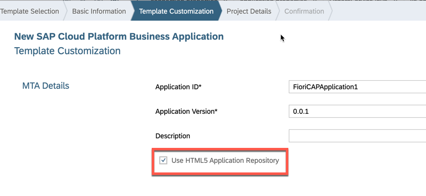
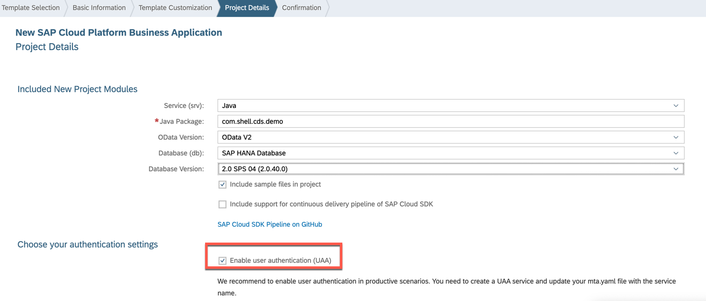
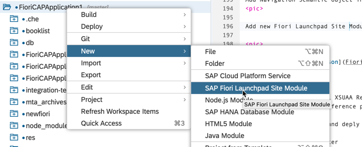
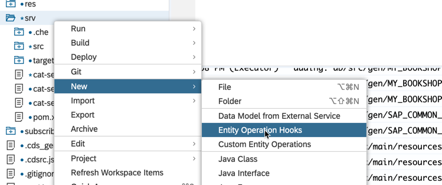
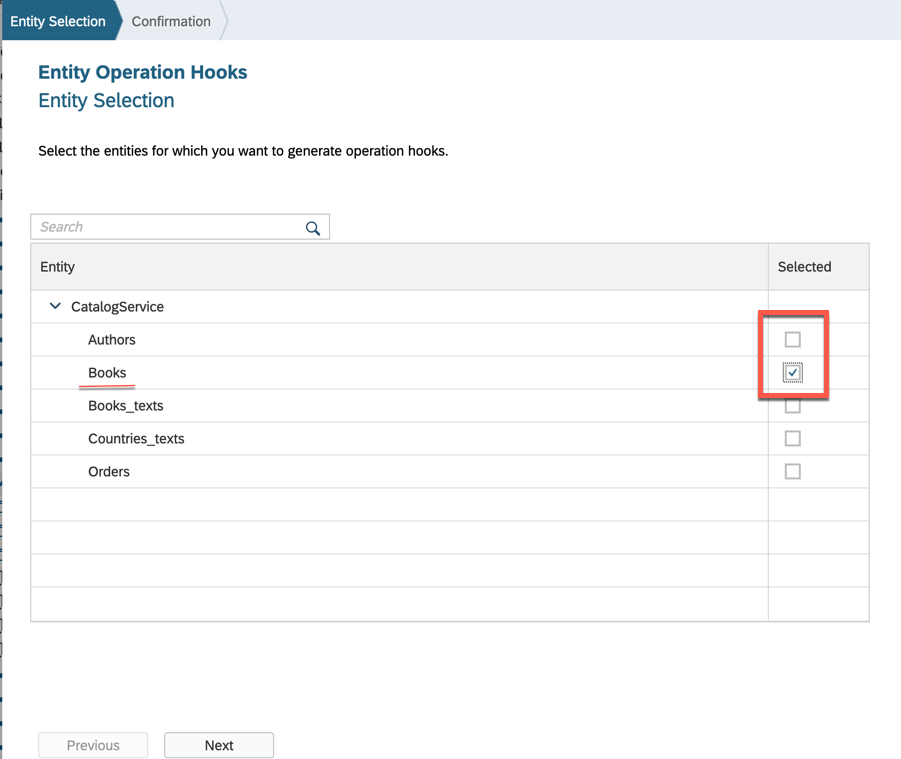
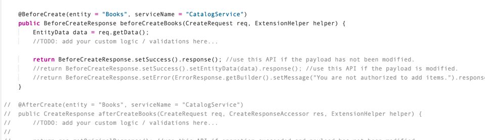

# FioriCAPApplication1
Demo Fiori Application with CAP Model

## Objective

In this exercise you will learn how to work with SAP CAP Model to build Fiori application with define security in SAP Cloud Platform Cloud Foundry Environment. Following diagram display the architecture for the sample
<p align="center"> </p>

## Prequisites

Make sure to have the following:

1. An SAP Cloud Platform (Cloud Foundry) account containing at least the services:
   - SAP HANA Database (Standard or Enterprise)
   - SAP HANA Schemas & HDI Containers (hdi-shared)
   - Portal Service
2. An SAP Cloud Platform (Neo) account that provides access to at least SAP Web IDE.

## Exercise description


### 1. Log on to SAP Web IDE

- If your are unsure where to find the Web IDE URL, follow this [tutorial](https://developers.sap.com/tutorials/sapui5-webide-open-webide.html).
- Web IDE opens up and shows your workspace. The workspace is empty if you use it for the first time.

   <p align="center"> </p>
   
### 2. Setup workspace settings

2.1. Click on `Cloud Foundry` in the `Workspace Preferences`

   - In the field for the `API endpoint` select the the URL that matches your Cloud Foundry account (usually the first URL).  If you are asked to logon, use your user/password.

   - Same for the values for `Organization` and `Space`: chose the values matching to your account.

   - Should the be an error on the page saying that the builder is outed, press the `Reinstall Builder` button.

   - Click on the **Save** button, even if you haven't changed anything.

   <p align="center"> </p>

   You will get a confirmation message:
   <p align="center"> </p>

   
   
### 3. Create Project from WebIDE Template

Use WebIDE Template `SAP Cloud Platform Business Application` to start the project structure 
<p align="center"> </p>

Check Option : Use HTML5 Application Repository

<p align="center"> </p>

Check Option : Enable User Authentication (UAA)

<p align="center"> </p>

### 4. XSUAA Instance from SCP Cockpit

Create service instance for XSUAA service manually from SCP Cockpit with name - `FioriCAPApplication1-uaa`  plan - `application` and following security setting
```
{
	"xsappname": "FioriCAPApplication1",
	"tenant-mode": "dedicated",
	"description": "Security Configuration for CAP application",
	"scopes": [
		{
			"name": "$XSAPPNAME.demouser",
			"description": "Demo Scope"
		},
		{
			"name": "uaa.user",
			"description": "UAA"
		}
	],
	"role-templates": [
		{
			"name": "demouser",
			"description": "Demo Role",
			"scope-references": [
				"$XSAPPNAME.demouser"
			]
		},
		{
			"name": "Token_Exchange",
			"description": "Token_Exchange",
			"scope-references": [
				"uaa.user"
			]
		}
	]
}
```

update Project file `mta.yaml` resource `FioriCAPApplication1-uaa` with existing service, created in previous step

From: 
```
  - name: FioriCAPApplication1-uaa
    type: org.cloudfoundry.managed-service
    parameters:
      service-plan: application
      service: xsuaa
      config:
        xsappname: FioriCAPApplication1-${space}
        tenant-mode: dedicated
```
to:
```
  - name: FioriCAPApplication1-uaa
    type: org.cloudfoundry.existing-service
    parameters:
      service-name: FioriCAPApplication1-uaa
```
`Build CDS` from Project level and `Build` DB module.
Test your `srv` module using WebIDE testing tools.

### 5. Add UI Module in project

Add HTML Module in project with List Report HTML5 Template
<p align="center"> </p>
<p align="center"> </p>

and bind with existing CDS OData V2 Service in project
<p align="center"> </p>
	
Tempalte added additional XSUAA Resource in `mta.yaml` file which need to replace with already created one `FioriCAPApplication1-uaa`.

checked the template code for new module, you find that now HTML5 module is using HTML5 repository service to host the application from central place. Details can be found in [SAP Blog](https://blogs.sap.com/2018/12/11/programming-applications-in-sap-cloud-platform).

In this example we have use Fiori Element to build UI, these Fiori element can be added via OData annotation by extending the exsiting cds model. Added new file `cat-service-fiori.cds` inside srv module

```
using CatalogService from '../srv/cat-service';

annotate CatalogService.Books with {
  ID 
    @Common.Label : 'Id';
  title 
    @Common.Label : 'Title';
  stock 
    @Common.Label : 'Stock';
  author
    @Common.Text: "author/name"
    @Common.Label : 'Author'
    @sap.value.list: 'fixed-values'
    @Common.ValueList: { 
      CollectionPath: 'Authors',
      Label: 'Authors',
      SearchSupported: 'true',
      Parameters: [
        { $Type: 'Common.ValueListParameterOut', LocalDataProperty: 'author_ID', ValueListProperty: 'ID'},
        { $Type: 'Common.ValueListParameterDisplayOnly', ValueListProperty: 'name'},
      ]
    };
    
};

annotate CatalogService.Books with @(
  UI.LineItem: [ 
    {$Type: 'UI.DataField', Value: ID},
    {$Type: 'UI.DataField', Value: title},
    {$Type: 'UI.DataField', Value: stock},
  ],
  
  UI.HeaderInfo: {
    Title: { Value: title },
    TypeName:'Book', 
        TypeNamePlural:'Books'
  },
  
  UI.Identification:
  [
    {$Type: 'UI.DataField', Value: ID},
    {$Type: 'UI.DataField', Value: title},
    {$Type: 'UI.DataField', Value: stock}
  ],
  
  UI.Facets:
  [
    {
      $Type:'UI.CollectionFacet', 
      Facets: [
            { $Type:'UI.ReferenceFacet', Label: 'General Info', Target: '@UI.Identification' }
          ],
      Label:'Book Details',		
    },
    {$Type:'UI.ReferenceFacet', Label: 'Orders', Target: 'orders/@UI.LineItem'},
  ]	
);
```

Add some sample data in DB for test purpose using [db/src/csv/Books.csv](db/src/csv/Books.csv) file.
Test your html5 module from WebIDE testing tools.

### 5. Add Fiori capabilties in project

 Add Navigation Semantic object inside html module `booklist`, file `manifest.json`  
 <p align="center"> </p>
 
 Add new `Fiori Launchpad Site Module` in Project with name `FioriCAPApplication1-fiori`
 
 <p align="center"> </p>
	
 Open [CommonDataModel.json](FioriCAPApplication1-fiori/portal-site/CommonDataModel.json) as Launchpad Editor and add your UI application using WebIDE wizard
 
 <p align="center"> </p>
	
Tempalte added additional XSUAA Resource in `mta.yaml` file which need to replace with already created one `FioriCAPApplication1-uaa`.
Update `mta.yaml` file reference of `portal_resources_FioriCAPApplication1` with name `FioriCAPApplication1-portal` for naming standard

 Build your application and deply to cf space.
 
 Run the application Router
 
 ### 6. Central Fiori Launchpad Configuration
 Create destination in Sub-Account Level with following information
```
sap-platform=CF
URL=<App_router_URL>
Name=PortalDemoApps
ProxyType=Internet
Type=HTTP
Authentication=NoAuthentication
Description=Portal Demo Application
```

In the side navigation panel of your subaccount, click `Subscriptions` and enter `Portal` in the search bar. Then click the Portal tile and Go to Application. The `Site Manager` opens with the Site Directory in focus.
Click the icon in the side panel of the Site Manager to open the `Content Manager`.
In the Content Manager, click + New > App

<p align="center"> </p>

In `properties` tab enter following

 - Title:	Books
 - System:	`DestinationName` created in previous step . Note that it may take several minutes until the destination that you created in step 2 appears in the System list.
 - App UI Technology :	SAPUI5 (this is the type of app that you are adding).
 - SAPUI5 Component Name :	booklist - this is the registered name of the SAPUI5 component. To get this name, ask your developer to open the component.js file in SAP Web IDE - it is defined in the component.js file without the .component suffix as shown here: Find component name

<p align="center"> </p>

Your screen will look like this:
<p align="center"> </p>

Click the `Navigation` tab and enter the following information


<p align="center"> </p>

Click the `Visualization` tab, Enter following information

<p align="center"> </p>

Click the Everyone role to open the Role editor edit add Application `Books`
<p align="center"> </p>

Click + New in the Content Manager and click Group to open the Group editor.

<p align="center"> </p>

 - In the Assignments panel on the right, search for your `Books` app and the click the + to assign your app to this group.
 - save the configuration.

 - Open any Sites which include lauchpad. View the application title. 


### 7. Adding security in project

#### Security at Central Fiori Lauchpad Level

 - Remove portal application `Books` from Everyone Role
 - Add new Role  `DemoUser` and add Book application in this Role
 - Update Portal site with `DemoUser` Role
 - Add your user to `DemoUser` Role from SCP Cockpit in Subaccount -> Security -> Trust Configuration for particular IDP 

#### Security at UI5 application Level
 - Add following information to UI application `booklist` in `manifest.json` file
```
"sap.platform.cf": {
        "oAuthScopes": [
            "$XSAPPNAME.demouser"
        ]
    }
```    
 - Build the application and deploy to SCP  
 - Add `demouser` role from Application to `DemoUser` Role Collection in Subaccount -> Security -> Role Collection

#### Security at application Service Level
 - Update [xs-app.json](booklist/xs-app.json) file for `booklist` (ui module) to pass security information to Service layer
from :
```
 {
      "source": "/srv_api/(.*)$",
      "target": "$1",
      "authenticationType": "none",
      "destination": "srv_api",
      "csrfProtection": false
    },
 ```   
to :
```
 {
      "source": "/srv_api/(.*)$",
      "target": "$1",
      "authenticationType": "xsuaa",
      "destination": "srv_api",
      "csrfProtection": false
    },
```    
-> Add [cat-service-auth.cds](srv/cat-service-auth.cds) security annotation inside srv module 

```
annotate CatalogService with @(requires: 'demouser');
```

### 8. Adding Custom Logic with DB Operations

 - Extension Class can created by WebIDE Template
 - Right click on srv module and create `Entity Operation Hooks`
 <p align="center"> </p> 

- Choose Entity which need to be extended 
 <p align="center"> </p> 
 
- This will generate new Java Class [BooksHooksHandler.java](srv/src/main/java/com/shell/cds/demo/handlers/catalogservice/BooksHooksHandler.java) for Handling Extension for Book Entity

#### Extension via DataSourceHandler

This type of Extension is for doing simple database operation like insert, Delete, Read , Update with Entity Key
- Let's create OData Function to read Book data from BookId.

- Update Catalog Service CDS model to include function defination in file  [cat-service.cds](srv/cat-service.cds)

```
function GetBookDetails(id:Integer) returns Books;
```
Open previously created Java Class and add following Code

```
	@Function(serviceName = "CatalogService", Name = "GetBookDetails")
	public OperationResponse getBooks(OperationRequest functionRequest, ExtensionHelper extensionHelper) {
		OperationResponse opResponse;

		try {
			// Retrieve the parameters of the function from the
			// OperationRequest object
			Map<String, Object> parameters = functionRequest.getParameters();

			//Get the DataSourceHandler object from the ExtensionHelper. This is required
			//to execute operations on the local HANA database
			DataSourceHandler handler = extensionHelper.getHandler();

			//Retrieve the Order ID from the request
			Map<String, Object> booksKey = new HashMap<String, Object>();
			booksKey.put("ID", String.valueOf(parameters.get("id")));

			List<String> bookElements = Arrays.asList("ID","title","stock");

			//Read the Order information from the local HANA database
			EntityData bookData = handler.executeRead("Books", booksKey, bookElements);
			List<EntityData> bookList = new ArrayList<EntityData>();
			bookList.add(bookData);
			// Return an instance of OperationResponse containing the list of book data
			opResponse = OperationResponse.setSuccess().setEntityData(bookList).response();

		} catch (Exception e) {
			log.error("Error in GetBook: " + e.getMessage());
			// Return an instance of OperationResponse containing the error in
			// case of failure
			ErrorResponse errorResponse = ErrorResponse.getBuilder()
					.setMessage(e.getMessage())
					.setCause(e)
					.response();

			opResponse = OperationResponse.setError(errorResponse);
		}
		return opResponse;
	}
```
run srv with following URL
```
/odata/v2/CatalogService/GetBookDetails?id=123
```

Detail operation support from DataSourceHandler is provided in [SCP Cloud SDK  API help](https://help.sap.com/doc/95d074a0671142da8dde4e6a29e622a9/Cloud/en-US/com/sap/cloud/sdk/service/prov/api/DataSourceHandler.html)

More details operation details are provide in CAP documentation - Coming soon


#### Extension via CDSDataSourceHandler

This type shloud be used for complex query opertions.
To execute any OData operation on a CDS data source, first create a `CDSDataSourceHandler` object passing a `Connection` object (that contains the CDS data source connection) and the namespace of the requested entity. 
The following code sample shows how you can create a `CDSDataSourceHandler` object:
```
CDSDataSourceHandler dsHandler = DataSourceHandlerFactory.getInstance().getCDSHandler(getConnection(), req.getEntityMetadata().getNamespace());
```

The following code sample shows how you can create a Connection object that contains the CDS data source connection:
```
private static Connection getConnection() {
  Connection conn = null;
  InitialContext ctx;
  try {
    ctx = new InitialContext();
    conn = ((DataSource) ctx.lookup("java:comp/env/jdbc/java-hdi-container")).getConnection();
  } catch (Exception e) {
    e.printStackTrace();
  }
  return conn;
}
```

- Query Operation
To implement the Query operation on a CDS data source, use the `CDSSelectQueryBuilder` and CDSQuery classes. The `CDSSelectQueryBuilder` class provides methods with which you can build the query and return it in a `CDSQuery` object. Use the `CDSDataSourceHandler` object to actually execute the query. The following is sample code that shows how you can implement it:

```
CDSQuery cdsQuery = new CDSSelectQueryBuilder("CatalogService.Books")
            .top(2)
            .skip(1)
            .selectColumns("ID","title","stock")
            .build();
		CDSSelectQueryResult cdsSelectQueryResult = dsHandler.executeQuery(cdsQuery);
```
Uncomment the Operation Handler method which need to be extended 
<p align="center"> </p>

Complete Code for After Read Book Entity is as follow. 
```
	@AfterRead(entity = "Books", serviceName = "CatalogService")
	public ReadResponse afterReadBooks(ReadRequest req, ReadResponseAccessor res, ExtensionHelper helper) {
		EntityData data = res.getEntityData();
		//TODO: add your custom logic / validations here...
		
		try{
		DataSourceHandler handler = helper.getHandler();
		CDSDataSourceHandler dsHandler = DataSourceHandlerFactory.getInstance().getCDSHandler(getConnection(), req.getEntityMetadata().getNamespace());
		
		CDSQuery cdsQuery = new CDSSelectQueryBuilder("CatalogService.Books")
            .top(2)
            .skip(1)
            .selectColumns("ID","title","stock")
            .build();
		CDSSelectQueryResult cdsSelectQueryResult = dsHandler.executeQuery(cdsQuery);
		data = cdsSelectQueryResult.getResult().get(0);
		}
		catch (Exception e) {
			
			log.error("Error in GetBook: " + e.getMessage());
			// Return an instance of OperationResponse containing the error in
			// case of failure
			ErrorResponse errorResponse = ErrorResponse.getBuilder()
					.setMessage(e.getMessage())
					.setCause(e)
					.response();

			return ReadResponse.setError(errorResponse);
		}
		

	//	return res.getOriginalResponse(); //use this API if no change is required and the original response can be returned as output.
	return ReadResponse.setSuccess().setData(data).response(); //use this API if the payload is modified.
		//return ReadResponse.setError(ErrorResponse.getBuilder().setMessage("Read Operation Failed").response()); //use this API if should return error response.
	}
```

Detail document can be found in CDS

For more complex Database operation JPA based opreation is also supported. Follow [Tutorial](https://developers.sap.com/tutorials/cp-apm-05-using-jpa.html) for same


