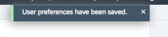

# FioriCAPApplication1
Demo Fiori Application with CAP Model

## Objective

In this exercise you will learn how to work with SAP CAP Model to build Fiori application with define security in SAP Cloud Platform Cloud Foundry Envirnment.

## Prequisites

Make sure to have the following:

1. An SAP Cloud Platform (Cloud Foundry) account containing at least the services:
   - SAP HANA Database (Standard or Enterprise)
   - SAP HANA Schemas & HDI Containers (hdi-shared)
   - Portal Service
2. An SAP Cloud Platform (Neo) account that provides access to at least SAP Web IDE.

## Exercise description


### 1. Log on to SAP Web IDE

- If your are unsure where to find the Web IDE URL, follow this [tutorial](https://developers.sap.com/tutorials/sapui5-webide-open-webide.html).
- Web IDE opens up and shows your workspace. The workspace is empty if you use it for the first time.

   <p align="center"> </p>
   
### 2. Setup workspace settings

2.1. Click on `Cloud Foundry` in the `Workspace Preferences`

   - In the field for the `API endpoint` select the the URL that matches your Cloud Foundry account (usually the first URL).  If you are asked to logon, use your user/password.

   - Same for the values for `Organization` and `Space`: chose the values matching to your account.

   - Should the be an error on the page saying that the builder is outed, press the `Reinstall Builder` button.

   - Click on the **Save** button, even if you haven't changed anything.

   <p align="center"> </p>

   You will get a confirmation message:
   <p align="center"> </p>

2.2. Click on the preferences icon on the left and select `Extensions`. Next, enter `HANA Database Dev` in the search box and switch `ON` the `SAP HANA Database Devlopment Tools`. Finally click on the `Save` button at the bottom to enable the tools in your workspace.

   <p align="center"> </p>

   In the pop-up click on **Refresh**, so that the Web IDE can be re-started with the new settings.

   <p align="center"> </p>
   
   
## Create Project from WebIDE Template

Use WebIDE Template : SAP Cloud Platform Business Application to start the project structure 


Create Manually service instance UAA instance - FioriCAPApplication1-uaa  with application plan and following security setting
```
{
	"xsappname": "FioriCAPApplication1",
	"tenant-mode": "dedicated",
	"description": "Security Configuration for CAP application",
	"scopes": [
		{
			"name": "$XSAPPNAME.demouser",
			"description": "Demo Scope"
		},
		{
			"name": "uaa.user",
			"description": "UAA"
		}
	],
	"role-templates": [
		{
			"name": "demouser",
			"description": "Demo Role",
			"scope-references": [
				"$XSAPPNAME.demouser"
			]
		},
		{
			"name": "Token_Exchange",
			"description": "Token_Exchange",
			"scope-references": [
				"uaa.user"
			]
		}
	]
}
```

and update mta.yaml -> resource "FioriCAPApplication1-uaa"

From: 
```
  - name: FioriCAPApplication1-uaa
    type: org.cloudfoundry.managed-service
    parameters:
      service-plan: application
      service: xsuaa
      config:
        xsappname: FioriCAPApplication1-${space}
        tenant-mode: dedicated
```
to:
```
  - name: FioriCAPApplication1-uaa
    type: org.cloudfoundry.existing-service
    parameters:
      service-name: FioriCAPApplication1-uaa
```
-> Build CDS from Project level and Build DB module

UI Module

-> Add HTML Module with List Report Template and bind with existing CDS OData V2 Service in project
-> Tempalte added additional XSUAA Resource which need to replace with already created one.
-> Add CDS for Fiori Element inside your srv module app with file cat-service-fiori.cds
-> add same sample data in DB for test purpose using db/src/csv/Books.csv file

Fiori
 -> Add Navigation Semantic object inside html module "booklist"
 -> Add Fiori Module from templates with name FioriCAPApplication1-fiori
 -> Open CommonDataModel.json file add your UI application using WebIDE wizard
 -> Update MTA file reference  uaa_FioriCAPApplication1 with our existing xsuaa instance : FioriCAPApplication1-uaa
 -> Update MTA file reference portal_resources_FioriCAPApplication1 with name FioriCAPApplication1-portal
 -> Build your application and deply to cf space
 
 Central Fiori Launchpad
 -> Create destination in Sub-Account Level
sap-platform=CF
URL=<App_router_URL>
Name=PortalDemoApps
ProxyType=Internet
Type=HTTP
Authentication=NoAuthentication
Description=Portal Demo Application

-> Subscribe Central Portal Service and access it
-> Create new app pointing to Fiori UI booklist application , UI5 component, Navigation and Visualization
-> Add this app to Everyone Role
-> Demo Group and add app to this group


Adding Security
> On Central Fiori Lauchpad Level
-> Remove application from Everyone Role
-> Add new Role - DemoUser and add Book application
-> Update Portal site with DemoUser Role
-> Add your user to DemoUser Role from SCP Cockpit 

> On UI5 application Level
-> Add following information to books manifest.json file
```
"sap.platform.cf": {
        "oAuthScopes": [
            "$XSAPPNAME.demouser"
        ]
    }
```    
-> Build the application and deploy to SCP  
-> Add 'demouser' role to 'DemoUser' Role Collection

> On Service Level
-> Update xs-app.json file for booklist (ui module)
from :
```
 {
      "source": "/srv_api/(.*)$",
      "target": "$1",
      "authenticationType": "none",
      "destination": "srv_api",
      "csrfProtection": false
    },
 ```   
to :
```
 {
      "source": "/srv_api/(.*)$",
      "target": "$1",
      "authenticationType": "xsuaa",
      "destination": "srv_api",
      "csrfProtection": false
    },
```    
-> Add cds security annotation in srv module 

```
annotate CatalogService with @(requires: 'demouser');
```

  


 
 


